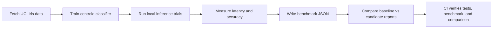
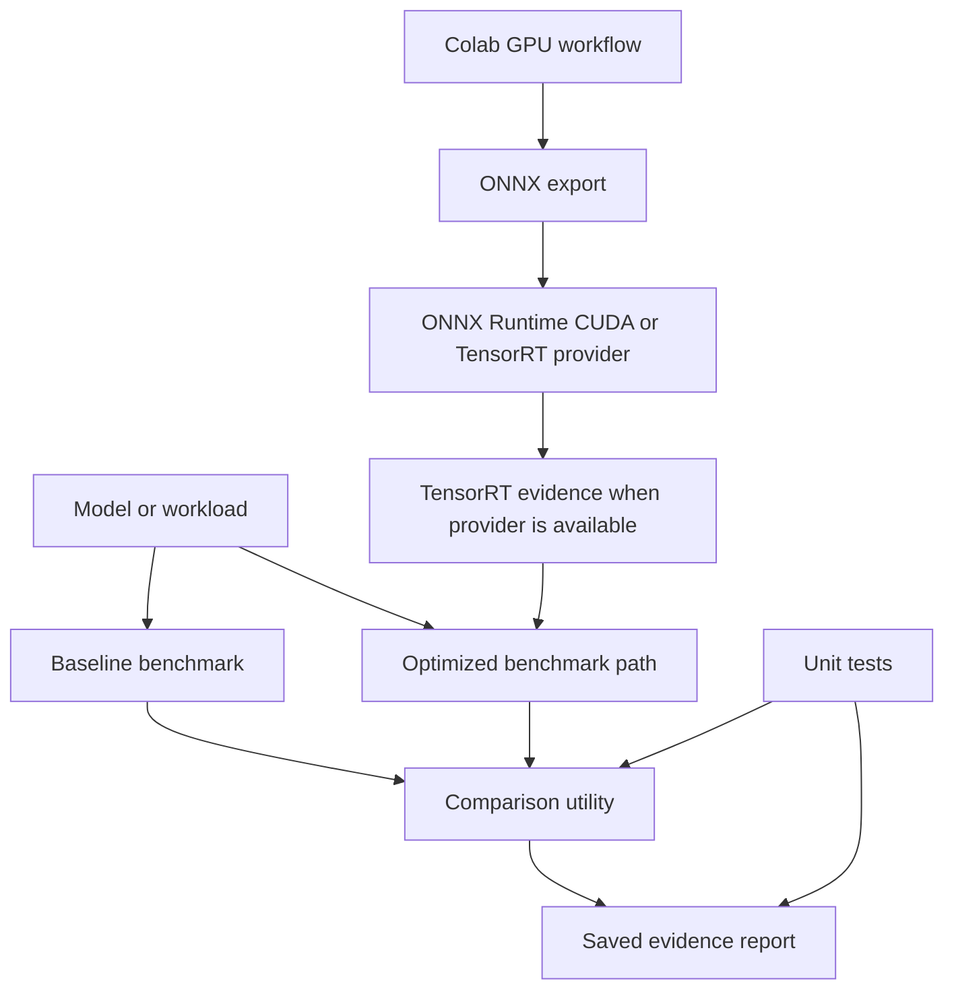

# TensorRT Model Optimization

[](https://github.com/nguyenthevietquang07/tensorrt-model-optimization/actions/workflows/ci.yml)

ML systems project for benchmarking model-export and inference paths. The local
code is dependency-light and CPU-safe; the Colab workflow produces GPU
artifacts for ONNX Runtime CUDA or TensorRT-specific acceleration evidence.

## Why This Project Exists

This project supports ML engineering and inference-systems roles by showing
performance thinking beyond model accuracy: repeatable inputs, comparable
settings, latency distributions, report validation, and a clear boundary
between local CPU evidence and GPU/TensorRT evidence.

## What It Demonstrates

- Benchmark result schema
- Real PyTorch CPU baseline model
- ONNX export path
- ONNX Runtime CPU inference benchmark
- Correctness comparison between PyTorch and ONNX Runtime logits
- Local CPU inference benchmark
- Real UCI Iris data benchmark with latency and accuracy reporting
- Offline handwritten-digits benchmark with larger sample and feature counts
- Report comparison utility with comparable-setting checks
- Optional ONNX Runtime and TensorRT extension points
- Colab GPU training, export, acceleration, and artifact validation workflow
- CI tests for benchmark reporting, data loading, and comparison logic
- QA notes for avoiding unverifiable speedup claims

## Tech Stack

| Layer | Tools |
|---|---|
| Benchmarking | Python, dataclasses, timing harness, JSON reports |
| Model path | PyTorch CPU baseline, ONNX export, ONNX Runtime CPU, TensorRT extension point |
| Data | UCI Iris fetcher, scikit-learn digits dataset, train/test split, centroid classifier baselines |
| GPU workflow | Colab GPU notebook, CUDA/TensorRT provider detection, artifact validator |
| Validation | comparable-setting checks, baseline/candidate report comparison |
| Quality | unittest, benchmark demo, comparison demo, GitHub Actions |

## Demo Flow



## Optimization Boundary



## Project Walkthrough

Run these commands to benchmark local inference, export a small PyTorch model
to ONNX, compare inference reports, and validate the saved Colab GPU artifacts.
The local path is CPU-safe; TensorRT-specific evidence comes from the committed
Colab reports.

```bash
python scripts/iris_real_data_benchmark.py --trials 200
python scripts/digits_real_data_benchmark.py --trials 200
python scripts/torch_onnx_demo.py
python scripts/compare_reports.py --baseline reports/pytorch_baseline_report.json --candidate reports/onnxruntime_report.json
python scripts/validate_colab_gpu_artifacts.py
```

Evidence map:

| Area | Feature | Evidence |
|---|---|---|
| Real data pipeline | UCI Iris fetch, split, and local benchmark | `reports/iris_real_data_benchmark.json` |
| Larger local workload | Handwritten digits, 64 features, 10 classes | `reports/digits_real_data_benchmark.json` |
| Export path | PyTorch model exported to ONNX | `models/iris_mlp.onnx`, `reports/torch_onnx_demo.json` |
| Correctness | PyTorch vs ONNX Runtime logit comparison | `reports/onnx_correctness_report.json` |
| CPU optimization evidence | Comparable PyTorch CPU vs ONNX Runtime CPU latency | `reports/onnx_comparison_report.json` |
| GPU acceleration evidence | Colab Tesla T4 TensorRT provider run | `reports/colab_gpu_validation.json` |
| Claim discipline | Provider, trial count, comparable settings, caveats | `scripts/validate_colab_gpu_artifacts.py` |

Implementation notes:

- Built a reproducible inference benchmarking toolkit with JSON reports,
  comparable-setting checks, and correctness validation.
- Added an offline handwritten-digits benchmark so the local evidence is not
  limited to the tiny Iris dataset.
- Exported a PyTorch Iris MLP to ONNX and verified prediction agreement with
  max absolute logit difference of `0.00000095` on the CPU path.
- The saved Colab Tesla T4 run used `TensorrtExecutionProvider`, 200 trials,
  and reports an `11.1290x` comparable mean speedup over PyTorch CUDA for this
  benchmark.
- Separated local CPU evidence, ONNX Runtime evidence, and TensorRT-specific
  GPU evidence.

## Measured Evidence

Run the real-data local inference benchmark:

```bash
python scripts/iris_real_data_benchmark.py --trials 200
python scripts/digits_real_data_benchmark.py --trials 200
```

Latest measured report: `reports/iris_real_data_benchmark.json`.

| Measurement | Value |
|---|---:|
| Dataset | UCI Iris |
| Samples processed | 150 |
| Train/test split | 120 / 30 |
| Features | 4 |
| Classes | 3 |
| Accuracy | 0.966667 |
| Mean inference latency | 0.1000 ms |
| p95 inference latency | 0.1575 ms |
| Trials | 200 |

Latest larger local benchmark: `reports/digits_real_data_benchmark.json`.

| Measurement | Value |
|---|---:|
| Dataset | scikit-learn handwritten digits |
| Samples processed | 1797 |
| Train/test split | 1547 / 250 |
| Features | 64 |
| Classes | 10 |
| Accuracy | 0.860000 |
| Mean inference latency | 23.7731 ms |
| p95 inference latency | 33.4859 ms |
| Trials | 200 |

Run the PyTorch-to-ONNX export and ONNX Runtime benchmark:

```bash
python scripts/torch_onnx_demo.py
python scripts/compare_reports.py --baseline reports/pytorch_baseline_report.json --candidate reports/onnxruntime_report.json
```

Latest ONNX report artifacts:

| Measurement | Value |
|---|---:|
| PyTorch baseline mean latency | 0.0423 ms |
| ONNX Runtime mean latency | 0.0227 ms |
| Comparable CPU mean speedup | 1.8634x |
| Comparable CPU p95 speedup | 2.5397x |
| PyTorch/ONNX prediction agreement | 1.0 |
| Max logit absolute difference | 0.00000095 |

This is real local CPU inference evidence.

Latest Colab TensorRT GPU artifacts:

| Measurement | Value |
|---|---:|
| GPU | Tesla T4 |
| Provider | TensorrtExecutionProvider |
| Baseline backend | PyTorch CUDA MLP |
| Candidate backend | ONNX Runtime TensorRT |
| PyTorch CUDA mean latency | 0.2070 ms |
| TensorRT mean latency | 0.0186 ms |
| Comparable mean speedup | 11.1290x |
| Comparable p95 speedup | 10.7977x |
| Trials per backend | 200 |
| Prediction agreement | 1.0 |
| Max logit absolute difference | 0.0 |
| Artifact validation | passed |

These TensorRT numbers come from a saved Colab GPU run on comparable hardware,
batch size, precision, model, and input settings. The reports remain scoped to
this Iris MLP benchmark and should not be generalized to unrelated models.

## Colab GPU Artifact Workflow

Use `notebooks/colab_training_plan.ipynb` in a Colab GPU runtime to generate
GPU artifacts. The notebook trains the Iris MLP, exports ONNX, benchmarks
PyTorch CUDA against the best available ONNX Runtime GPU provider, and saves
JSON evidence under `reports/`.

Validate downloaded artifacts with:

```bash
python scripts/validate_colab_gpu_artifacts.py
```

Expected GPU artifacts:

- `reports/colab_gpu_environment.json`
- `reports/colab_gpu_pytorch_report.json`
- `reports/colab_gpu_candidate_report.json`
- `reports/colab_gpu_correctness_report.json`
- `reports/colab_gpu_comparison_report.json`
- `reports/colab_gpu_validation.json`

If the selected provider is `CUDAExecutionProvider`, the artifacts support GPU
inference evidence but not TensorRT speedup wording. TensorRT-specific claims
require `selected_provider: "TensorrtExecutionProvider"` and passing correctness
and comparable-setting reports.

## Quickstart

Run local benchmark and comparison utilities:

```bash
python -m pip install -r requirements.txt
python -m src.modelopt.benchmark --trials 25
python -m src.modelopt.benchmark --trials 25 --output reports/local_cpu_report.json
python scripts/iris_real_data_benchmark.py --trials 200
python scripts/digits_real_data_benchmark.py --trials 200
python scripts/torch_onnx_demo.py
python scripts/compare_reports.py --baseline reports/local_cpu_report.json --candidate reports/local_cpu_report.json
```

Run tests:

```bash
python -m unittest discover -s tests
```

## Colab Workflow

Use `notebooks/colab_training_plan.ipynb` when training or GPU acceleration is
needed. Save exported model artifacts and benchmark logs under `reports/`
before using any speedup metric.

## Documentation

- `docs/qa_ci.md`: test strategy, CI checks, and quality gates
- `docs/real_data_pipeline.md`: source, measurement method, and claim boundary
- `docs/engineering_quality.md`: completed engineering practices and evidence rules
- `docs/colab_gpu_runbook.md`: exact Colab GPU run and claim-boundary checklist

## Scope

This is a CPU-safe benchmarking toolkit with PyTorch-to-ONNX export, ONNX
Runtime CPU inference, local Iris and handwritten-digits benchmarks, comparable
report validation, CI tests, and a Colab GPU artifact workflow. TensorRT speedup
claims require a saved Colab or local GPU report with comparable hardware,
batch size, precision, and input settings.
