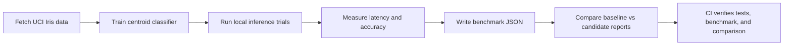
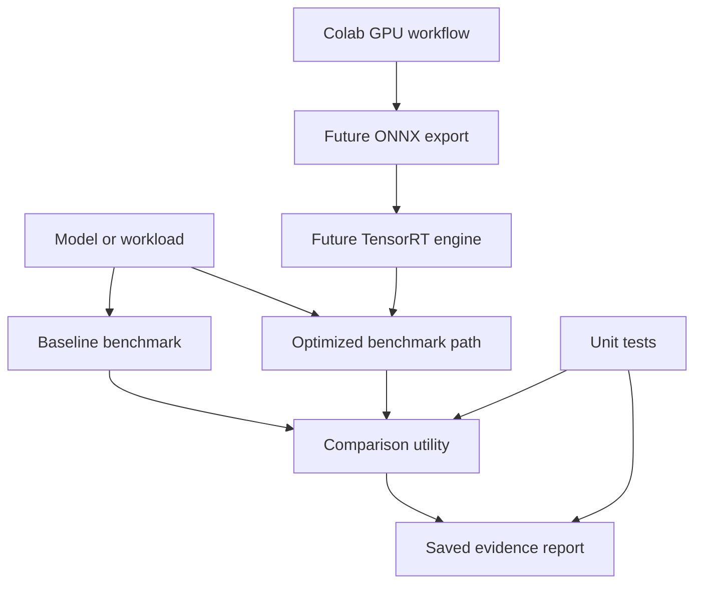

# TensorRT Model Optimization

[](https://github.com/nguyenthevietquang07/tensorrt-model-optimization/actions/workflows/ci.yml)

ML systems project for benchmarking model-export and inference paths. The local
code is dependency-light and CPU-safe; the Colab workflow is the planned path
for GPU training, ONNX export, and TensorRT-specific acceleration evidence.

## Why This Project Exists

This project supports ML engineering and inference-systems roles by showing
performance thinking beyond model accuracy: repeatable inputs, comparable
settings, latency distributions, report validation, and a clear boundary
between local CPU evidence and GPU/TensorRT evidence.

## What It Demonstrates

- Benchmark result schema
- Real PyTorch CPU baseline model
- ONNX export path
- ONNX Runtime CPU inference benchmark
- Correctness comparison between PyTorch and ONNX Runtime logits
- Local CPU inference benchmark
- Real UCI Iris data benchmark with latency and accuracy reporting
- Report comparison utility with comparable-setting checks
- Optional ONNX Runtime and TensorRT extension points
- Colab-first training, export, and acceleration plan
- CI tests for benchmark reporting, data loading, and comparison logic
- QA notes for avoiding unverifiable speedup claims

## Tech Stack

| Layer | Tools |
|---|---|
| Benchmarking | Python, dataclasses, timing harness, JSON reports |
| Model path | PyTorch CPU baseline, ONNX export, ONNX Runtime CPU, TensorRT extension point |
| Data | UCI Iris fetcher, train/test split, centroid classifier baseline |
| GPU workflow | Colab notebook plan for training/export/acceleration evidence |
| Validation | comparable-setting checks, baseline/candidate report comparison |
| Quality | unittest, benchmark demo, comparison demo, GitHub Actions |

## Demo Flow



## Optimization Boundary



## Measured Evidence

Run the real-data local inference benchmark:

```bash
python scripts/iris_real_data_benchmark.py --trials 200
```

Latest measured report: `reports/iris_real_data_benchmark.json`.

| Measurement | Value |
|---|---:|
| Dataset | UCI Iris |
| Samples processed | 150 |
| Train/test split | 120 / 30 |
| Features | 4 |
| Classes | 3 |
| Accuracy | 0.966667 |
| Mean inference latency | 0.1000 ms |
| p95 inference latency | 0.1575 ms |
| Trials | 200 |

Run the PyTorch-to-ONNX export and ONNX Runtime benchmark:

```bash
python scripts/torch_onnx_demo.py
python scripts/compare_reports.py --baseline reports/pytorch_baseline_report.json --candidate reports/onnxruntime_report.json
```

Latest ONNX report artifacts:

| Measurement | Value |
|---|---:|
| PyTorch baseline mean latency | 0.0658 ms |
| ONNX Runtime mean latency | 0.0225 ms |
| Comparable CPU mean speedup | 2.9244x |
| Comparable CPU p95 speedup | 4.4027x |
| PyTorch/ONNX prediction agreement | 1.0 |
| Max logit absolute difference | 0.00000095 |

This is real local CPU inference evidence. TensorRT speedup evidence requires a
saved GPU/TensorRT report from comparable hardware and input settings.

## Quickstart

Run local benchmark and comparison utilities:

```bash
python -m pip install -r requirements.txt
python -m src.modelopt.benchmark --trials 25
python -m src.modelopt.benchmark --trials 25 --output reports/local_cpu_report.json
python scripts/iris_real_data_benchmark.py --trials 200
python scripts/torch_onnx_demo.py
python scripts/compare_reports.py --baseline reports/local_cpu_report.json --candidate reports/local_cpu_report.json
```

Run tests:

```bash
python -m unittest discover -s tests
```

## Colab Workflow

Use `notebooks/colab_training_plan.ipynb` when training or GPU acceleration is
needed. Save exported model artifacts and benchmark logs under `reports/`
before using any speedup metric.

## Documentation

- `docs/qa_ci.md`: test strategy, CI checks, and quality gates
- `docs/real_data_pipeline.md`: source, measurement method, and claim boundary
- `docs/agile_backlog.md`: prioritized backlog and delivery plan

## Portfolio Positioning

Built an ML optimization scaffold for benchmarking baseline inference, export
paths, PyTorch-to-ONNX export, ONNX Runtime CPU inference, real UCI Iris local
inference, latency/accuracy reporting, comparable report validation, and
optional TensorRT acceleration, with CI tests and a Colab-first GPU workflow for
reproducible measurements.

Current scope: CPU-safe benchmark and optimization scaffold. TensorRT speedup
claims require a saved Colab or local GPU report with comparable hardware,
batch size, precision, and input settings.
