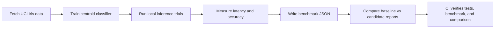
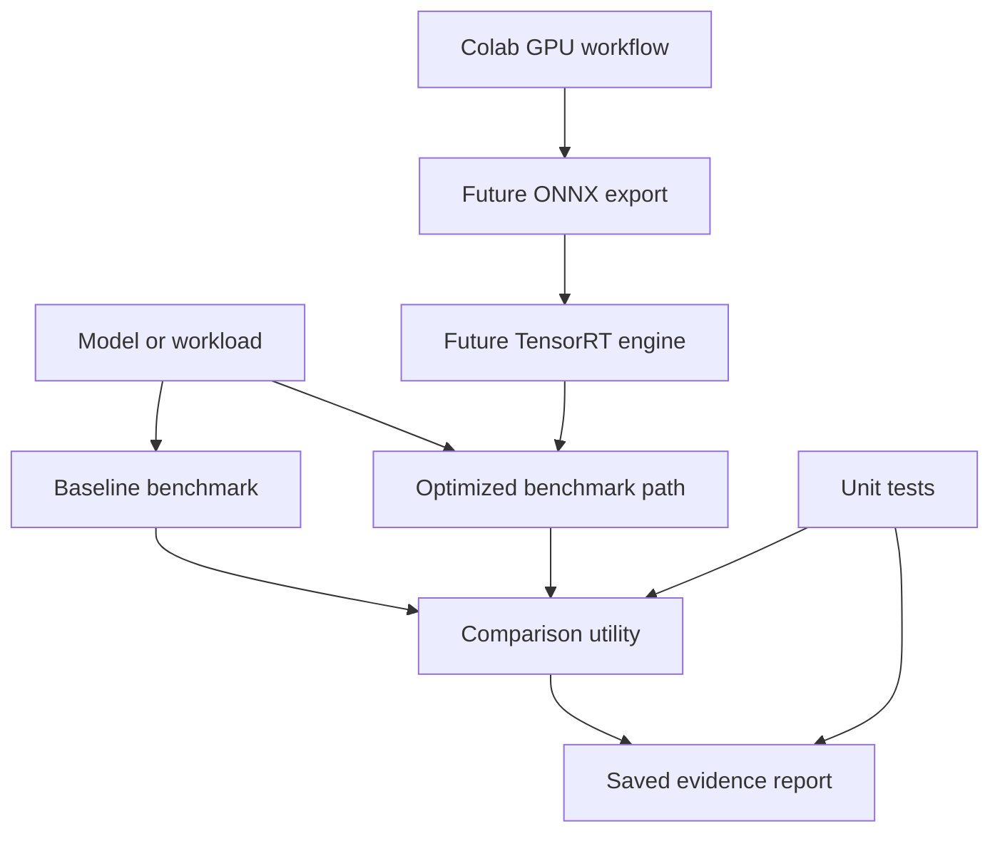

# TensorRT Model Optimization

ML systems starter repo for benchmarking model-export and inference paths. The
local code is dependency-light and CPU-safe; the Colab notebook path is where
GPU training or TensorRT-specific work should happen.

## Why this exists

The project supports ML engineering and computer-vision resumes by showing
performance thinking: baseline timing, export boundaries, reproducible
benchmarks, and clear fallback behavior when TensorRT is unavailable.

This is a passion project because I wanted to understand the engineering around
model speed, not just model accuracy: repeatable inference inputs, latency
measurements, comparable settings, and the exact point where a CPU benchmark
should become a Colab/GPU/TensorRT experiment.

## Features

- Benchmark result schema
- Local CPU fallback benchmark
- Report comparison utility with comparable-setting checks
- Optional ONNX Runtime and TensorRT extension points
- Colab-first training/acceleration notebook plan
- CI tests for benchmark reporting and configuration
- QA notes for avoiding unverifiable speedup claims

## Tech Stack

| Layer | Tools |
|---|---|
| Benchmarking | Python, dataclasses, timing harness, JSON reports |
| Model path | local CPU fallback, ONNX/TensorRT extension points |
| GPU workflow | Colab notebook plan for training/export/acceleration evidence |
| Validation | comparable-setting checks, baseline/candidate report comparison |
| Quality | unittest, benchmark demo, comparison demo, GitHub Actions |

## Demo Flow



## Optimization Boundary



## Real Data Benchmark

Run the real-data local inference benchmark:

```bash
python scripts/iris_real_data_benchmark.py --trials 200
```

Latest measured report: `reports/iris_real_data_benchmark.json`.

| Measurement | Value |
|---|---:|
| Dataset | UCI Iris |
| Samples processed | 150 |
| Train/test split | 120 / 30 |
| Features | 4 |
| Classes | 3 |
| Accuracy | 0.966667 |
| Mean inference latency | 0.1000 ms |
| p95 inference latency | 0.1575 ms |
| Trials | 200 |

This is real local CPU inference evidence. It does not claim TensorRT speedup;
that requires a saved GPU/ONNX/TensorRT report from comparable hardware and
input settings.

## Quickstart

```bash
python -m src.modelopt.benchmark --trials 25
python -m src.modelopt.benchmark --trials 25 --output reports/local_cpu_report.json
python scripts/iris_real_data_benchmark.py --trials 200
python scripts/compare_reports.py --baseline reports/local_cpu_report.json --candidate reports/local_cpu_report.json
python -m unittest discover -s tests
```

## Colab workflow

Use `notebooks/colab_training_plan.ipynb` when training or GPU acceleration is
needed. Save exported model artifacts and benchmark logs under `reports/` before
using any speedup metric on a resume.

## Resume-safe claim

Built an ML optimization scaffold for benchmarking baseline inference, export
paths, real UCI Iris local inference, latency/accuracy reporting, and optional
TensorRT/ONNX acceleration, with CI tests and a Colab-first GPU workflow for
reproducible measurements.

Do not claim a TensorRT speedup until a saved Colab or local GPU report exists.
